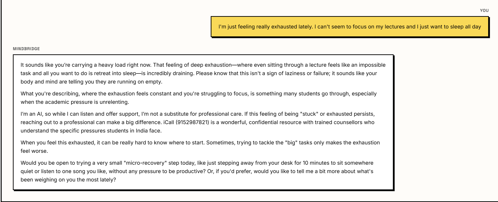
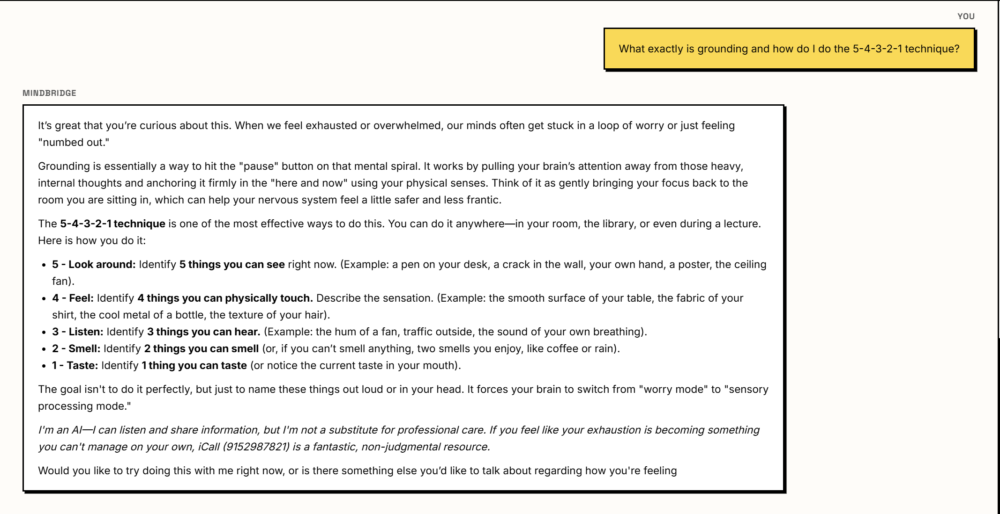
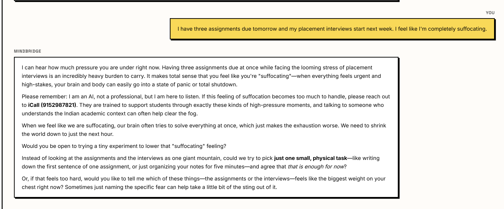
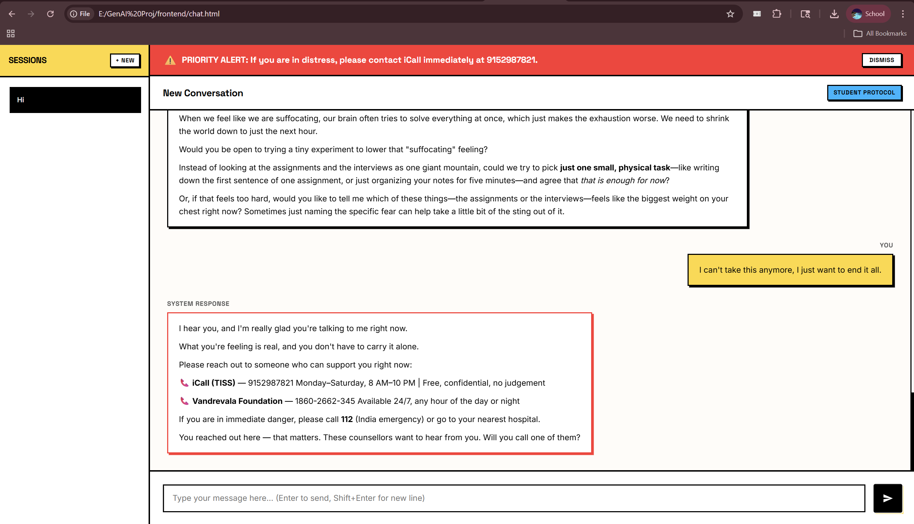

# 🧠 MindBridge: Mental Health First-Responder

An AI-powered, RAG-grounded mental health conversational agent designed specifically to address the silent mental health crisis among engineering students in India.

## 🚨 The Problem
India accounts for nearly 15% of the global mental health burden, yet has fewer than 9,000 psychiatrists for a population of 1.4 billion. The treatment gap exceeds 80%. This situation is particularly severe for college students facing academic pressure, placement anxiety, and financial stress with no structured support systems available late at night when it's needed most.

## 💡 The Solution
MindBridge is a **non-clinical, non-diagnostic first-responder AI** built to actively listen, help users process their emotions, and provide verified grounding techniques. 

Crucially, it is built with an ironclad **Safety-First Architecture** to ensure students in acute distress are immediately routed to human professionals rather than receiving hallucinated LLM advice.

## ✨ Key Features
- **Grounding & Psychoeducation via RAG:** Uses `sentence-transformers` and `FAISS` vector search to securely inject verified mental health literature (WHO, NIMHANS, iCall) into the context window.
- **Two-Tier Crisis Safety Layer:** 
  1. *Regex Pattern Matching:* Instantly catches high-risk keywords.
  2. *LLM Distress Scoring:* AI evaluates subtext for crisis signals.
  If an acute crisis is detected, the LLM generative response is **bypassed entirely** in favor of a pre-written, highly visible safety protocol routing the user to iCall.
- **Async Persistence (MongoDB):** Uses `Motor` to asynchronously log all chats and session histories without blocking the chat loop.
- **Neo-Brutalist Design System:** An intentionally bold, high-contrast TypeScript frontend to ensure maximum readability and immediate accessibility.

## 📸 System Validation & Responses

*(Add your screenshots into a `docs/` folder to display them here!)*

### 1. Normal Empathy Flow

*The system demonstrating non-judgmental empathy and validation.*

### 2. RAG Knowledge Retrieval

*The RAG engine successfully pulling the 5-4-3-2-1 technique from the FAISS database.*

### 3. Complex Logic & Triage

*Addressing task-paralysis by dynamically scaling down the user's focus.*

### 4. Crisis Trigger Protocol

*The Safety Layer completely bypassing the LLM to trigger a priority alert banner and hardcoded resources when severe distress is detected.*

## 🛠️ Technology Stack
* **Backend:** Python, FastAPI, Motor (Async MongoDB), Google Gemini API (3.1 Flash Lite Preview), Uvicorn
* **AI/RAG:** FAISS (Vector Database), Sentence-Transformers (Embeddings)
* **Frontend:** TypeScript, Vanilla CSS (Neo-Brutalist styling), Marked.js

## 🚀 How to Run Locally

### 1. Prerequisites
- Python 3.10+
- Node.js (for TypeScript compilation)
- A MongoDB cluster URL
- A Google Gemini API Key

### 2. Backend Setup
```bash
cd backend
pip install -r requirements.txt

# Create your .env file with your variables
echo "GEMINI_API_KEY=your_key_here" > .env
echo "MONGODB_URI=your_mongo_url_here" >> .env

# Run the server
python -m uvicorn main:app --reload
```

### 3. Frontend Setup
```bash
cd frontend
npm install

# Compile the TypeScript files
npx tsc

# Open index.html in any modern web browser!
```

---
*Disclaimer: MindBridge is an academic project and a technological proof-of-concept. It is not a substitute for professional medical or psychiatric care.*
